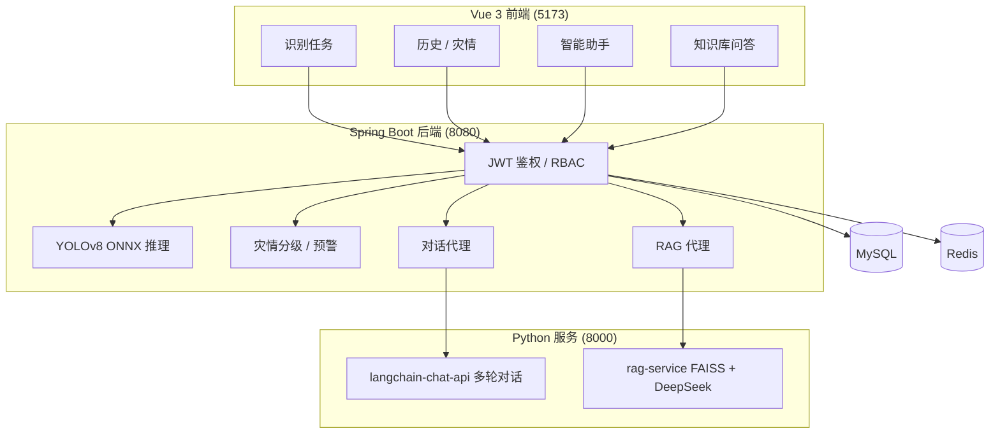

# 滑坡识别与智能防灾系统

[](https://www.oracle.com/java/)
[](https://spring.io/projects/spring-boot)
[](https://vuejs.org/)
[](https://github.com/ultralytics/ultralytics)
[](rag-service/)
[](LICENSE)

> **遥感影像滑坡自动识别 · 灾情分级预警 · 大模型智能助手 · 专业知识库 RAG 问答 · 全栈工程化部署**

**在线仓库**：[github.com/xuehualiange/landslide-detection](https://github.com/xuehualiange/landslide-detection)

---

## 项目简介

本系统面向滑坡监测与防灾业务，形成 **「感知识别 → 灾情评估 → 预警推送 → 知识问答」** 的完整闭环：

- 上传遥感/现场影像，由 **YOLOv8** 自动框选滑坡区域并计算灾情等级
- 结合 **WebSocket** 实时推送预警，支持多角色协同管理
- 接入 **DeepSeek 大模型**，提供可结合识别历史的智能对话
- 基于自建 **滑坡专业知识库**，提供可溯源的 **RAG 检索增强问答**

---

## 核心功能

| 模块 | 功能说明 | 前端路由 |
|------|----------|----------|
| **滑坡识别** | 拖拽上传影像，YOLOv8n ONNX 推理，Canvas 可视化检测框，自动判定灾情等级 | `/detect-task` |
| **历史记录** | 查看历次识别结果、检测框与灾情等级 | `/history` |
| **灾情动态** | 管理员查看预警事件与灾情信息流 | `/disaster-feed` |
| **智能助手** | 多轮对话，可注入近期识别记录作为上下文 | `/ai-chat` |
| **知识库问答** | 基于专业文献与规范的 RAG 问答，回答附带引用来源 | `/rag-ask` |
| **权限管理** | JWT + RBAC 三级角色（监测员 / 管理员 / 超级管理员） | `/users` `/roles` |
| **个人中心** | 账号资料维护 | `/profile` |

### 知识库 RAG 能力（rag-service）

- **向量检索**：FAISS + HuggingFace Embeddings，支持离线构建索引
- **混合检索**：关键词预筛 + 向量相似度 + GB/T 术语 fallback
- **题型优化**：定义类 / 列举类 / 对比判别类（如推移式 vs 牵引式）分策略检索与作答
- **知识库**：9 份文档、约 330 切块（GB/T 32864、监测/灾害链综述、知识点索引等）

### 模型与推理成果

| 指标 | 数值 | 说明 |
|------|------|------|
| **mAP@0.5** | **95.1%** | Bijie 验证集 554 张 |
| mAP@0.5:0.95 | 64.9% | epoch 100 |
| 精确率 / 召回率 | 90.4% / 91.4% | - |
| **推理耗时（中位数）** | **103 ms** | 640×640，Java + OpenCV DNN，CPU |
| 训练集规模 | 2773 张 | 正样本 770，负样本 2003 |

---

## 系统架构



> **端口说明**：langchain-chat-api 与 rag-service 默认均占用 **8000**，请勿同时启动。

---

## 快速开始

### 前置要求

- JDK 17+、Maven 3.6+、Node.js 18+
- MySQL 8.0+（Redis 可选）
- Python 3.10+（智能助手 / RAG 服务）

### 1. 克隆仓库

```bash
git clone https://github.com/xuehualiange/landslide-detection.git
cd landslide-detection
```

### 2. 初始化数据库

```powershell
Get-Content ".\docs\db-schema-v2.sql" | mysql -u root -p
Get-Content ".\docs\data.sql" | mysql -u root -p
```

### 3. 一键启动（Windows）

```powershell
powershell -ExecutionPolicy Bypass -File .\start-all.ps1
```

仅启动前后端：

```powershell
powershell -ExecutionPolicy Bypass -File .\start-all.ps1 -SkipAssistant
```

### 4. 启动知识库 RAG 服务

```powershell
cd rag-service
.\.venv\Scripts\python.exe ingest.py
.\start.bat
```

### 5. 访问地址

| 服务 | 地址 |
|------|------|
| 前端 | http://localhost:5173 |
| 后端 API | http://localhost:8080 |
| 健康检查 | http://localhost:8080/api/health |
| 智能助手 API | http://localhost:8000/docs |
| RAG 问答 API | http://localhost:8000/ask |

**默认测试账号**（密码 `123456`）：`superadmin` / `admin` / `monitor`

---

## Docker 部署（可选）

```bash
docker compose up -d --build
```

需设置 `DEEPSEEK_API_KEY`，详见 [docker-compose.yml](docker-compose.yml)。

---

## 性能压测

```powershell
cd backend
powershell -ExecutionPolicy Bypass -File scripts\benchmark-yolo.ps1
```

本机实测：median **103 ms**（640×640，CPU）。

---

## 项目结构

```text
landslide-detection/
├── backend/              # Spring Boot（YOLO 推理、预警、RAG/对话代理）
├── frontend/             # Vue 3（识别、助手、知识库问答）
├── rag-service/          # FAISS RAG 问答 + knowledge/
├── langchain-chat-api/   # LangChain 多轮对话
├── fastapi-chat/         # 离线占位助手
├── docs/                 # 数据库脚本、需求说明
├── docker-compose.yml
└── start-all.ps1
```

---

## 技术栈

| 层 | 技术 |
|----|------|
| AI 识别 | YOLOv8n, ONNX, OpenCV DNN |
| 知识问答 | FastAPI, FAISS, LangChain, HuggingFace Embeddings, DeepSeek |
| 智能对话 | LangChain, DeepSeek API |
| 后端 | Spring Boot 2.7, MyBatis-Plus, WebSocket, JWT |
| 前端 | Vue 3, Vite, Element Plus |
| 数据 | MySQL, Redis |
| 部署 | PowerShell 脚本, Docker Compose |

---

## 相关文档

- [需求与模块说明](docs/requirements-overview.md)
- [RAG 服务说明](rag-service/README.md)
- [智能助手说明](langchain-chat-api/README.md)

---

## 常见问题

| 现象 | 处理 |
|------|------|
| 页面 ECONNREFUSED | 确认后端 `/api/health` 可访问 |
| RAG 服务不可用 | 启动 rag-service，检查 `/health` 为 ready |
| RAG 中文 500 | 用 start.bat 启动；克隆后运行 ingest.py |
| 8000 端口冲突 | langchain-chat-api 与 rag-service 二选一 |
| 模型缺失 | ONNX 放到 backend/models/landslide-yolov8.onnx |

---

## 开源协议

MIT License

## 联系我

- 邮箱：1270231737@qq.com
- GitHub：[xuehualiange](https://github.com/xuehualiange)

## 致谢

- 课题来源：国家重点研发计划子课题《地下多源多场传感集成的特大滑坡实时监测技术与装备研制》
- 数据集：[Bijie Landslide Dataset](https://github.com/zhaoyangxia/landslide-dataset)
- 框架：Ultralytics YOLOv8, OpenCV DNN, LangChain, FAISS