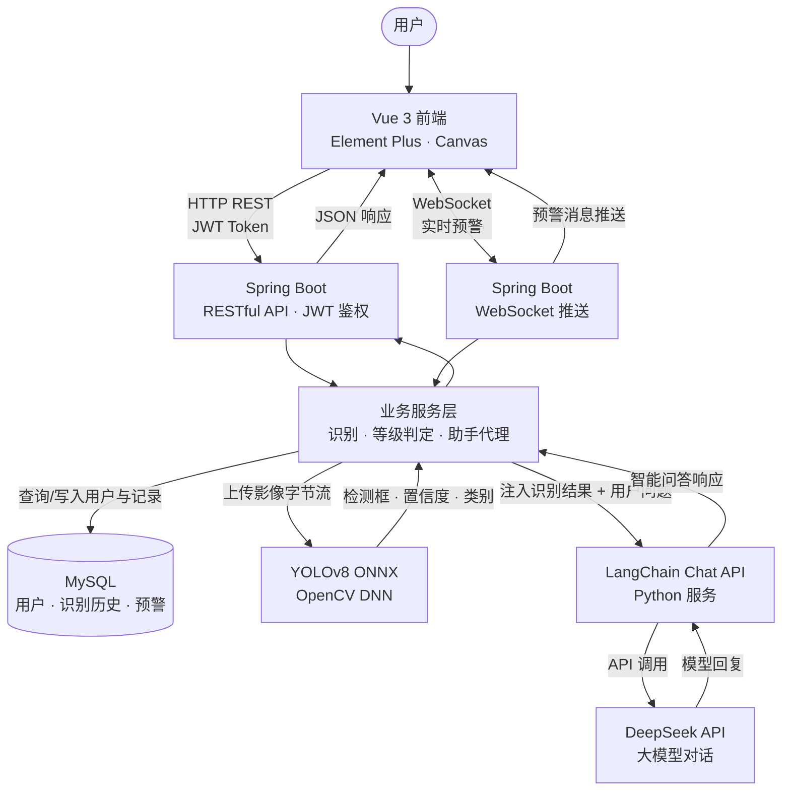

# 滑坡识别系统 Landslide Detection System

[](https://www.oracle.com/java/)
[](https://spring.io/projects/spring-boot)
[](https://vuejs.org/)
[](https://github.com/ultralytics/ultralytics)
[](LICENSE)

> **智能滑坡识别系统 | 从遥感影像自动检测滑坡区域 | 集成大模型智能问答 | 全栈工程化部署**
<p align="center">
  <strong>国家重点研发计划子课题成果</strong>
</p>

<p align="center">
  <a href="#-性能指标"></a>
  &nbsp;
  <a href="#-性能指标"></a>
  &nbsp;
  <a href="#-性能指标"></a>
  &nbsp;
  <a href="#-性能指标"></a>
</p>


**在线仓库**：[github.com/xuehualiange/landslide-detection](https://github.com/xuehualiange/landslide-detection)

## 🎯 项目亮点

- **高性能 AI 推理**：YOLOv8n + ONNX + Java OpenCV DNN，单张 640×640 影像推理 **中位数 103 ms**（CPU，本机压测）
- **高精度模型**：在 Bijie 滑坡数据集上 **mAP@0.5 达 95.1%**（精确率 90.4%，召回率 91.4%）
- **大模型增强**：集成 LangChain + DeepSeek，实现多轮记忆智能对话，可解释识别结果、对比历史灾情
- **全栈闭环**：Spring Boot + Vue 3 + WebSocket 实时预警 + JWT 三级权限
- **工程化完备**：一键启动脚本、性能压测工具、答辩/部署文档

## 📊 性能指标

| 指标 | 数值 | 说明 |
|------|------|------|
| **mAP@0.5** | **95.1%** | 验证集 554 张 |
| mAP@0.5:0.95 | 64.9% | epoch 100 |
| 精确率 | 90.4% | - |
| 召回率 | 91.4% | - |
| **推理耗时（中位数）** | **103 ms** | 640×640，Java + OpenCV DNN，CPU 全链路 |
| 训练集规模 | 2773 张 | 正样本 770，负样本 2003 |

## 🏗️ 系统架构



## 🚀 快速开始

### 前置要求

- JDK 17+
- Maven 3.6+
- Node.js 18+
- MySQL 8.0+
- Redis（可选，默认 localhost:6379）

### 1. 克隆仓库

```bash
git clone https://github.com/xuehualiange/landslide-detection.git
cd landslide-detection
```

### 2. 初始化数据库

在 MySQL 中执行（将路径改为你本机克隆目录）：

```powershell
Get-Content ".\docs\db-schema-v2.sql" | mysql -u root -p
Get-Content ".\docs\data.sql" | mysql -u root -p
```

### 3. 一键启动（推荐，Windows）

在项目**根目录**执行（依次启动后端、前端；若配置了 DeepSeek Key，会再启动智能助手）：

```powershell
powershell -ExecutionPolicy Bypass -File .\start-all.ps1
```

仅启动前后端、不启 Python 助手：

```powershell
powershell -ExecutionPolicy Bypass -File .\start-all.ps1 -SkipAssistant
```

**智能助手 API Key（任选其一）：**

1. 启动前：`$env:DEEPSEEK_API_KEY = "sk-你的密钥"`
2. 在 `langchain-chat-api` 目录创建 `.deepseek_key`（纯文本一行，勿提交 Git）
3. 传参：`-DeepSeekApiKey "sk-..."`

### 4. 访问地址

| 服务 | 地址 |
|------|------|
| 前端 | http://localhost:5173 |
| 后端 | http://localhost:8080 |
| 健康检查 | http://localhost:8080/api/health |
| 智能助手 API | http://localhost:8000/docs |

**默认测试账号**（密码均为 `123456`）：`superadmin` / `admin` / `monitor`

更完整的参数说明、手动启动与排错见下文 [常见问题](#-常见问题)。

## 🧪 性能压测

压测类 `YoloDetectorBenchmark.java` 走与线上一致的 `YoloDetector.detect()` 全链路（读图 → blob → forward → 解析 → NMS）。

```powershell
cd backend
powershell -ExecutionPolicy Bypass -File scripts\benchmark-yolo.ps1
# 强制重新编译：加 -Rebuild
```

**本机实测结果示例：**

```text
median : 103 ms  <-- resume
min/avg/p95/max : 95 / 103.5 / 115 / 115 ms
```

## 📁 项目结构

```text
landslide-detection/
├── backend/                          # Spring Boot 后端
│   ├── src/main/java/.../ai/
│   │   ├── YoloDetector.java         # ONNX 推理核心
│   │   └── YoloDetectorBenchmark.java
│   ├── models/landslide-yolov8.onnx  # YOLOv8 ONNX 权重
│   └── scripts/                      # 启动 / 压测 / 环境检查
├── frontend/                         # Vue 3 前端
├── langchain-chat-api/               # LangChain + DeepSeek 智能问答
├── fastapi-chat/                     # 离线占位助手（无 API Key 时）
├── docs/                             # 数据库脚本、答辩导读、简历片段
├── tools/                            # 数据集准备、重训练脚本
└── start-all.ps1                     # 根目录一键启动
```

## 🛠️ 技术栈

| 层 | 技术 |
|----|------|
| AI 推理 | YOLOv8n, ONNX, OpenCV DNN |
| 大模型 | LangChain, DeepSeek API |
| 后端 | Spring Boot 2.7, MyBatis-Plus, WebSocket, JWT, Spring Security |
| 前端 | Vue 3, Vite, Element Plus, Canvas |
| 数据库 | MySQL, Redis |
| 部署 | PowerShell 一键脚本 |

## 📝 相关文档

- [答辩代码导读](docs/答辩代码导读.md)
- [简历项目描述（含实测指标）](docs/resume-project-snippet.md)
- [智能助手说明](langchain-chat-api/README.md)

## 📄 开源协议

MIT License

## 📧 联系我

- 邮箱：1270231737@qq.com
- GitHub：[xuehualiange](https://github.com/xuehualiange)

## 🙏 致谢

- 毕设来源于国家重点研发计划子课题《地下多源多场传感集成的特大滑坡实时监测技术与装备研制》
- 数据集：[Bijie Landslide Dataset](https://github.com/zhaoyangxia/landslide-dataset)
- 框架：Ultralytics YOLOv8, OpenCV DNN, LangChain

---

## ❓ 常见问题

- **页面 `ECONNREFUSED`**：后端未启动或端口不通，先访问 `/api/health`
- **`mvn` 找不到**：检查 `MAVEN_HOME` 与 `Path`，或使用 `start-all.ps1` 自动配置
- **识别框过多/过少**：调整后端 `ai.yolo.conf-threshold`（当前默认 0.45）
- **智能助手不可用**：确认 8000 端口 LangChain 服务已启，且已配置 `DEEPSEEK_API_KEY`
- **模型缺失**：将 ONNX 放到 `backend/models/landslide-yolov8.onnx`；缺失时系统降级启动，管理功能仍可用